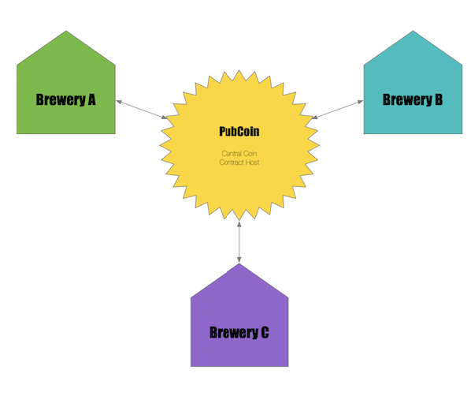
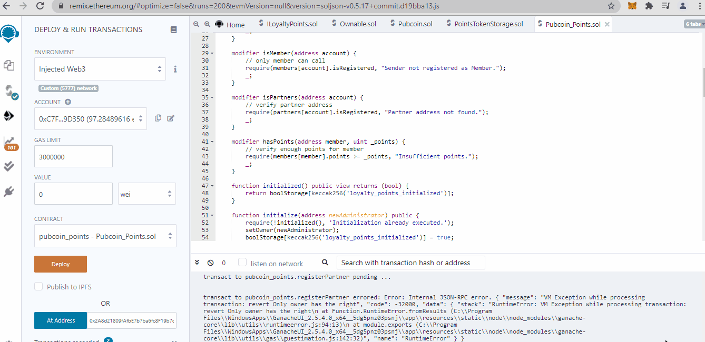
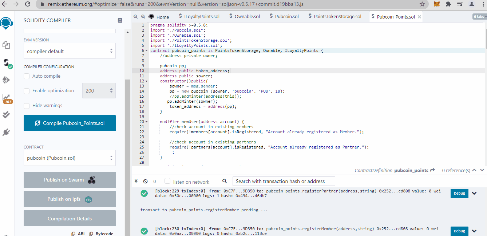

# Pubcoin
## *"Bringing crypto to your local breweries"*

## Team Members:
___ 
Matthew Newkirk  
James Reeves  
Blake Cizek  
Abdullahi Said  
Endalkachew Desta  
Matt Houk  
  
## Motivation & Learning Objectives:
___
- Develop technical expertise in creating fungible tokens and transaction functions deployed as solidity contracts on the ethereum blockchain
  
## Project Objectives:
___
- Leveraging ERC20, create a TaaS (Token-as-a-Service) marketplace for small businesses, breweries for this iteration, to reward its customers for brand loyalty and for customers to exchange their tokens across the network
  
## Project Summary:
___
- Developed and minted the “PubCoin” as the asset by which businesses can register a stake in the loyalty token and/or mint their own token at a specified exchange rate for PubCoins
- Customers who register on the “PubCoin” marketplace can exchange tokens with fellow patrons and be rewarded additional tokens or exchange their balance for product/services by their brewery of choice for brand loyalty 

## Conceptual Diagram
___
### *Multi-Token System*

  
### *Single-Token System*

  
## Technical Summary
___
### *Tools & Standards used:*
- Developed in Remix and used MetaMask to deploy locally via Ganache and to the Ropsten Testnet
- PubCoin token was minted using standards from ERC20, ERC20 Mintable and ERC20 Detailed
### *Contracts developed:*
- **Pubcoin** contract used to mint **“PubCoin”**, and any unique brewery token
- **PointsTokenStorage**, and **Ownable** contracts used to initialize **PubCoin_Points**
- **PubCoin_Points** contracts designed to enable registration of businesses and customers and the transaction of **PubCoins** across the marketplace
### *Why Blockchain for Rewards/Loyalty Points system?*
Traditional loyalty systems suffer from low redemption rates, high costs, few customer incentives and security concerns
Blockchain systems offer open systems, less clutter, more flexibility, reduced costs, overall transparency, less fraud, and more security
Value Adds: Easier implementation, better accounting, happier customers, access to a network of loyal customers
  
## PubCoin Demo
___
### Initial Deployment

### Initialization Registration

### One Click dApp Deployment

  
## Retrospective
___
### *Challenges*:
- Working backwards from the original ideas of providing every small business with a means to create a token to reward customers and to create excitement around their brand took many discussions to convert concept scope to code
- Still haven’t quite fully rationalized both in concept and in execution the dynamics of creating a Multi-token vs Single-Global-token for “PubCoin” loyalty points
- A “teething” experience in developing expertise in solidity and deploying to a Testnet 
- Issues in creating a front-end to the contracts, using One Click dApp as the constructor
### *Future Roadmap:*
- Iron out tokennomics of a multi-token vs. single-token loyalty marketplace
Evaluate If ERC777 is a better choice than ERC20
Harden development of a front-end web application for the contracts

